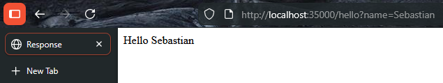
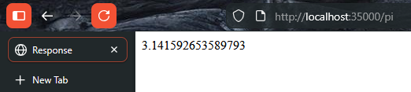
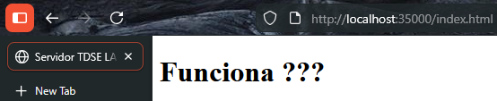

# MicroframeworkWEB

Lightweight HTTP micro-framework for building REST services and serving static files. Built from scratch using Java sockets to demonstrate fundamental web server concepts.

## Description

Educational web framework that implements:
- Endpoints with lambda expressions
- Static file serving
- HTTP request/response handling
- Query parameter parsing

## Architecture

### Components

- **HttpServer** - Main server listening on port 35000.
- **Request** - Parses HTTP requests and query parameters
- **Response** - Manages HTTP response
- **WebMethod** - Functional interface for endpoint handlers
- **WebApp** - Example application with `/hello` and `/pi` endpoints

### Data Flow
1. Client → HTTP request (port 35000)
2. Server parses request URI
3. Registered endpoint? → Execute handler | No endpoint? → Serve static file
4. Send response and close connection

## Prerequisites

- Java 21 or higher
- Maven 3.6+

## How to Run

**Build:**
```bash
mvn clean install
```

**Run WebApp:**
```bash
mvn exec:java -Dexec.mainClass="edu.lab.tdse.microframeworkweb.Server.WebApp"
```

**Server starts on:** `http://localhost:35000`

## Usage Examples

### Static Files
Access files in `target/classes/webroot/`:
```
http://localhost:35000/index.html
```

### Endpoints

**Hello endpoint:**
```bash
curl "http://localhost:35000/hello?name=Sebastian"
# Returns: Hello Sebastian
```

**Pi endpoint:**
```bash
curl "http://localhost:35000/pi"
# Returns: 3.141592653589793
```

### Custom Endpoint
```java
HttpServer.staticfiles("/webroot");
HttpServer.get("/hello", (req, resp) -> "Hello " + req.getValues("name"));
HttpServer.main(args);
```

## Tests Performed







## Project Structure

```
src/main/java/.../Server/
├── HttpServer.java    # Server
├── WebApp.java        # Example app
├── Request.java       # Request parser
├── Response.java      # Response
└── WebMethod.java     # Interface
```

## Built With

- **Java 21** - Programming language
- **Maven** - Dependency management
- **Spring Boot 4.0.3** - Parent dependency
- **Java ServerSocket** - HTTP communication

## Author

**Juan Sebastian Puentes Julio**

## Acknowledgements

- Professor Implementation

---
**TDSE Lab 05** - Web Framework Development for REST Services and Static File Management

